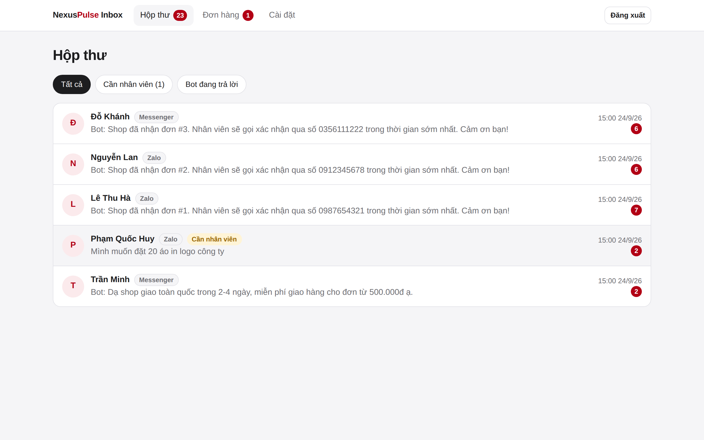
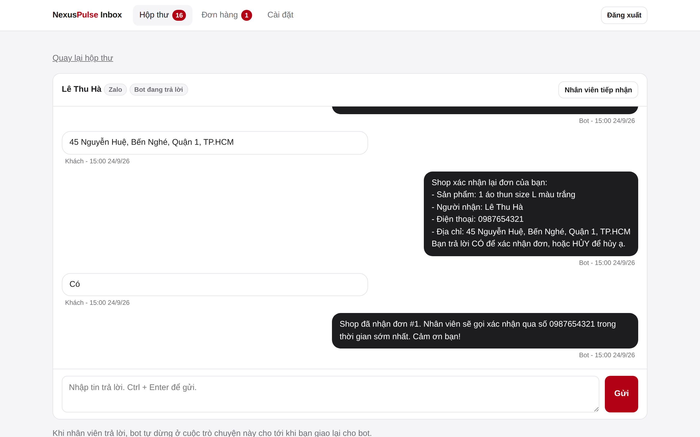
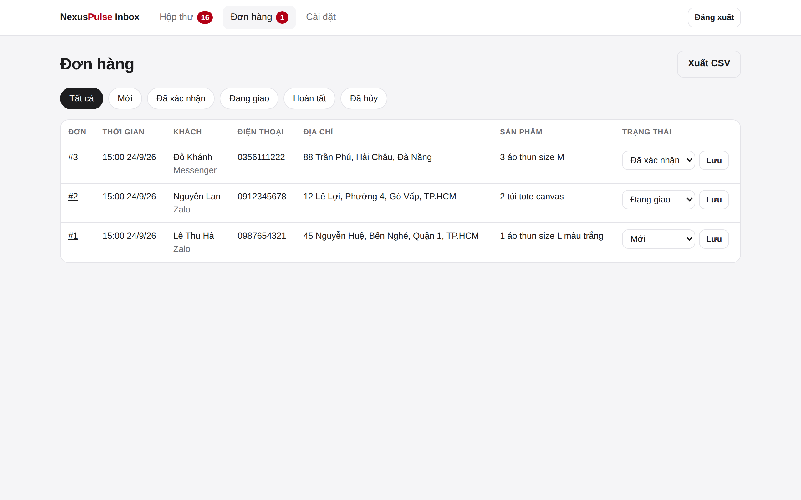
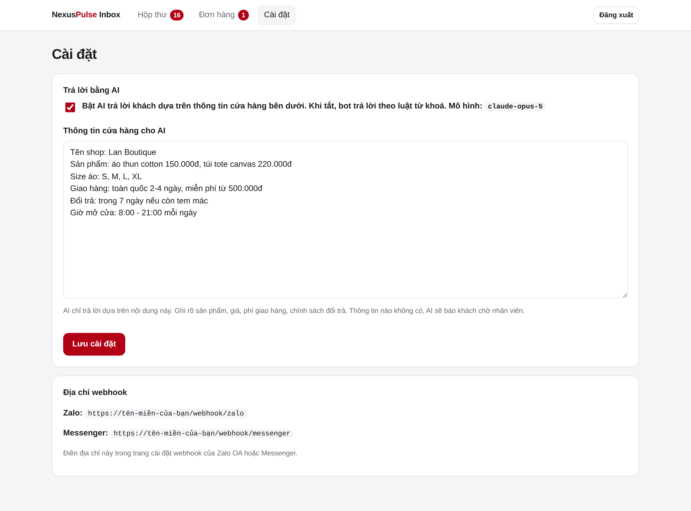
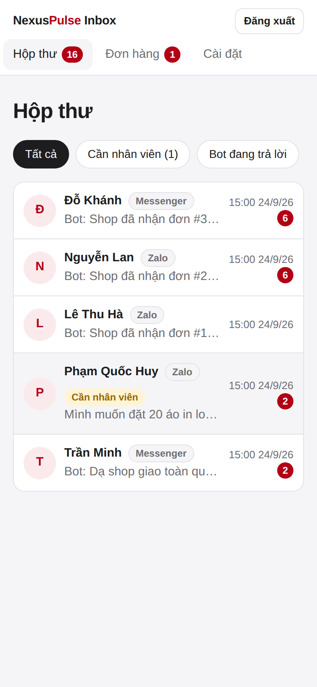
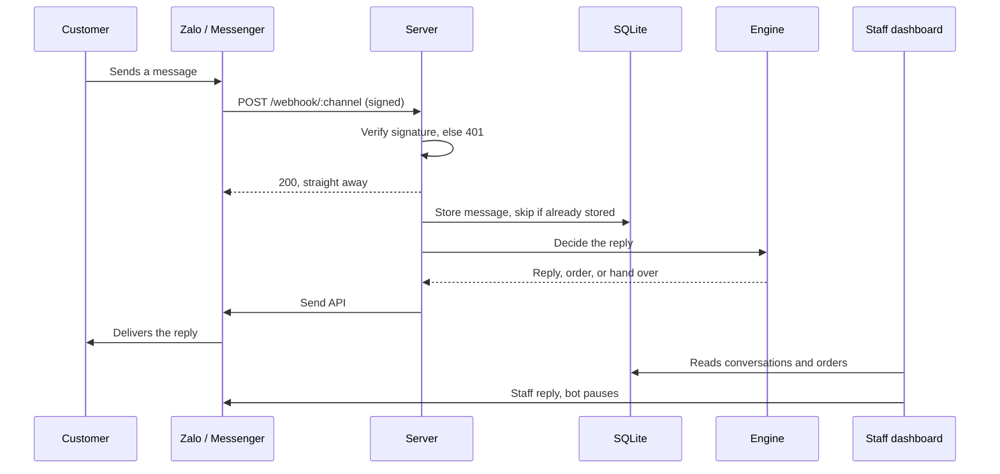

# NexusPulse Inbox, Community Edition

[](https://github.com/NexusPulseTech/chat-bot-starter/actions/workflows/ci.yml)
[](LICENSE)


A self-hosted chatbot and shared inbox for **Zalo Official Account** and **Facebook Messenger**. The bot answers customers, takes orders step by step, and hands the conversation to your staff when a person is needed. Everything is managed from a web dashboard, and everything is stored in one SQLite file.



> [!NOTE]
> **Status.** 131 automated tests cover the bot, the dashboard and the webhooks, and CI builds and starts the Docker image on every push. It has **not yet been run against a live Zalo OA or Messenger page**, and the AI replies have not been run against the live Claude API. Read [Before going live](#before-going-live) first.

## Features

**Shared inbox**
- Conversations from Zalo OA and Messenger in one place, with unread counts and a "needs staff" filter.
- Staff reply from the dashboard. The moment a person replies, the bot stops answering that customer, until staff hand the conversation back.
- Customers can ask for a person themselves by sending "gặp nhân viên".
- Failed sends are kept and shown with the provider's error, for example when Zalo's customer care window has closed.

**Order taking in chat**
- Customers send "đặt hàng" and the bot asks for items, name, phone and address, then shows a summary to confirm.
- Vietnamese mobile numbers are validated and normalised: `+84 912 345 678` is stored as `0912345678`.
- An order in progress survives a restart, and quick consecutive messages are handled in order.
- Orders page with status tracking, and CSV export that opens in Excel with Vietnamese intact.

**AI replies**
- Answers with Claude from the business information you type in the dashboard: products, prices, delivery, returns.
- Instructed never to invent prices or policies; when unsure it tells the customer a person will follow up.
- Without an API key, the bot answers from keyword rules. With `FORWARD_URL`, an n8n or Make.com workflow answers instead.

**Built for production**
- Webhook signatures are verified on every delivery, with constant-time comparison.
- Redelivered webhooks are recognised by a unique database index, so a customer never gets the same answer twice, even across restarts.
- The platform is answered immediately and the message is handled afterwards, which is what prevents redeliveries in the first place.
- Dashboard login with hashed server-side sessions, CSRF tokens, rate limiting, and a strict Content-Security-Policy.
- Graceful shutdown: replies in progress finish before the process exits on deploy.

## Try it in one minute

No Zalo, Messenger or Anthropic account needed. The demo plays sample conversations through the real bot, keeps everything in memory, and prints replies instead of sending them.

```bash
git clone https://github.com/NexusPulseTech/chat-bot-starter.git
cd chat-bot-starter
npm install
npm run demo
```

Open <http://localhost:3000/admin> and log in with `demo-password-2026`.

| Conversation | Orders |
| --- | --- |
|  |  |

| Settings | Mobile |
| --- | --- |
|  |  |

## How the bot decides what to answer

Checks run in this order, and the first one that applies wins. The logic is in [`src/bot/engine.ts`](src/bot/engine.ts).

1. **A person has taken over** the conversation: the bot stays silent.
2. **An order is in progress**: the bot asks for the next detail.
3. **The customer asks for a person**: the conversation moves to staff.
4. **The customer wants to order**: the order flow starts.
5. **`FORWARD_URL` is set**: an external workflow answers.
6. **AI is on**: Claude answers from your business information.
7. **Otherwise**: keyword rules, then a polite fallback.



## Deploy

Requires Node.js 22.13 or later, or Docker.

```bash
cp .env.example .env    # fill in your channels and ADMIN_PASSWORD
docker compose up -d --build
```

Data is kept on the `bot-data` volume. Put the service behind HTTPS, for example with Caddy:

```
bot.example.com {
    reverse_proxy localhost:3000
}
```

Then set `TRUST_PROXY=true`, so login rate limiting sees real client addresses.

Without Docker:

```bash
npm ci
npm run build
npm start
```

### Connect the platforms

**Messenger.** In your app's Messenger settings, set the callback URL to `https://your-domain/webhook/messenger` and the verify token to `MESSENGER_VERIFY_TOKEN`. Meta calls the URL once to confirm it, which the server answers automatically. Subscribe the page to the `messages` field.

**Zalo OA.** In the Zalo developer console, set the webhook URL to `https://your-domain/webhook/zalo` and enable the `user_send_text` event.

## Configuration

Everything is set through environment variables. [`.env.example`](.env.example) lists them all with comments. The server refuses to start with something half-configured and names every missing variable.

| Variable | Purpose |
| --- | --- |
| `ZALO_APP_ID`, `ZALO_OA_SECRET_KEY`, `ZALO_OA_ACCESS_TOKEN` | Zalo OA channel |
| `MESSENGER_APP_SECRET`, `MESSENGER_PAGE_ACCESS_TOKEN`, `MESSENGER_VERIFY_TOKEN` | Messenger channel |
| `ADMIN_PASSWORD` | Turns the dashboard on at `/admin`. At least 12 characters |
| `ANTHROPIC_API_KEY` | Turns AI replies on |
| `AI_MODEL`, `AI_EFFORT` | Claude model (default `claude-opus-5`) and effort (default `low`) |
| `FORWARD_URL`, `FORWARD_TOKEN` | Send messages to an external workflow instead |
| `DATABASE_PATH` | SQLite file. Default `./data/bot.db`, `/app/data/bot.db` in Docker |
| `COOKIE_SECURE`, `TRUST_PROXY` | Dashboard cookie and proxy settings |
| `TIMEZONE` | Times in the dashboard and exports. Default `Asia/Ho_Chi_Minh` |

### AI replies

Set `ANTHROPIC_API_KEY`, then write your business information on the dashboard's settings page. Changes apply to the next message, without a restart.

The request uses the official Anthropic SDK with low effort, since short support replies do not need deep reasoning. The system prompt is marked for prompt caching, and `fallbacks: "default"` is enabled: if a safety classifier declines a message, the API retries on the model Anthropic recommends for that case instead of leaving the customer unanswered. If every attempt fails, the customer gets the fallback reply. The code is in [`src/ai/claude.ts`](src/ai/claude.ts).

### External workflows

With `FORWARD_URL` set, each message is posted to that endpoint as JSON:

```json
{ "channel": "zalo", "messageId": "z1", "senderId": "84123456789", "text": "Giá bao nhiêu?", "receivedAt": "2026-09-24T06:00:00.000Z" }
```

Answer with `{ "reply": "..." }` to reply, or anything else to stay silent. In n8n that is a **Webhook** node followed by **Respond to Webhook**. Ordering and asking for a person are still handled by the bot, so they keep working whatever the workflow does.

## Before going live

- **Test with a real account first.** Connect a test Zalo OA and Messenger page, send messages, and check replies and orders in the dashboard.
- **Confirm the Zalo signature formula.** It is implemented from Zalo's documentation and isolated in [`src/security/signature.ts`](src/security/signature.ts). Platforms revise these schemes, so check it against the [current docs](https://developers.zalo.me/docs/official-account).
- **Zalo access tokens expire.** Refresh `ZALO_OA_ACCESS_TOKEN` on a schedule, or sends start failing. The dashboard shows each failed send with the error.
- **Zalo's customer care window.** An OA can only send customer service messages for a limited time after the customer last wrote. Replies outside it are rejected and marked as failed.
- **Back up the database.** Everything is in the `bot-data` volume. Copy `bot.db` while the service is stopped, or use `sqlite3 bot.db ".backup backup.db"` while it runs.
- **One instance.** SQLite is a single file on one machine. Run one instance; for several, the store needs a shared database such as PostgreSQL.

## Project structure

```
src/
  index.ts            Entry point and graceful shutdown
  app.ts              Wires configuration into the running app
  demo.ts             Offline demo with sample data
  config.ts           Environment loading and validation
  server.ts           Webhook routes, body limit, acknowledge-then-handle
  bot/                Decision engine, order flow, inbox
  ai/claude.ts        AI replies through the Anthropic SDK
  channels/           Zalo OA and Messenger adapters
  db/                 SQLite schema, migrations and queries
  web/                Dashboard: pages, sessions, CSRF, CSV export
  security/           Webhook signature checks
test/                 131 tests, run on Node.js 22 and 24 in CI
docs/screenshots/     Images used in this README
```

## Testing

```bash
npm test
```

The suite includes:
- Signature checks against tampered bodies and wrong secrets.
- Duplicate webhook deliveries, both concurrent and after a restart.
- Full orders placed over several messages, including fast consecutive ones.
- Hand-over to staff and back.
- AI request shape and refusal handling.
- Dashboard login, CSRF rejection, rate limiting and security headers.
- Escaping of customer messages, and spreadsheet formula injection in exports.

The HTTP tests start a real server on a random port. CI runs everything on Node.js 22 and 24, then builds the Docker image and checks that the container serves the dashboard and creates its database on the volume.

## Community Edition and hosted service

This repository is the Community Edition: free under the MIT License, self-hosted, for one business.

For several shops on one system, hosting, and support, [contact NexusPulse](https://www.linkedin.com/company/nexuspulsetech/).

---

## Tiếng Việt

**NexusPulse Inbox** là chatbot kèm hộp thư chung cho **Zalo OA** và **Facebook Messenger**, tự cài trên máy chủ của bạn:

- **Hộp thư chung:** tin nhắn từ Zalo và Messenger về một nơi. Nhân viên trả lời ngay trên dashboard, và bot tự dừng khi nhân viên tiếp nhận.
- **Lên đơn trong chat:** khách nhắn "đặt hàng", bot hỏi lần lượt sản phẩm, tên, số điện thoại, địa chỉ rồi xác nhận. Đơn hàng xem và xuất ra Excel được.
- **Trả lời bằng AI:** AI trả lời theo thông tin cửa hàng bạn nhập, không tự bịa giá hay chính sách.
- **Gọn nhẹ:** toàn bộ dữ liệu nằm trong một file SQLite, chạy bằng Docker.

Chạy thử không cần tài khoản nào: `npm install && npm run demo`, rồi mở <http://localhost:3000/admin>, mật khẩu `demo-password-2026`.

## About

Built and maintained by [NexusPulse](https://nexuspulsetech.github.io), a software outsourcing and product development studio in Ho Chi Minh City.

Released under the [MIT License](LICENSE).
