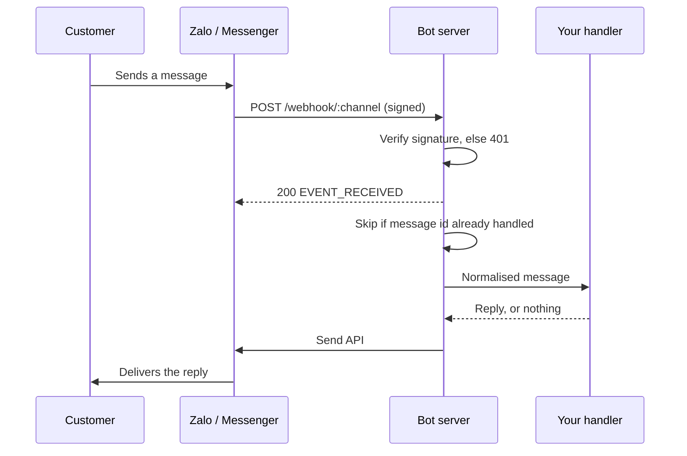

# Zalo OA + Messenger Bot Starter

[](https://github.com/NexusPulseTech/chat-bot-starter/actions/workflows/ci.yml)
[](LICENSE)


A starter webhook server for chatbots on **Zalo Official Account** and **Facebook Messenger**, written in TypeScript. One handler answers both channels.

> [!NOTE]
> **Status:** a foundation to build a bot on, not a finished product. It is covered by unit and HTTP tests, but has not yet been run against a live Zalo OA or Messenger page. See [Production notes](#production-notes) before going live.

It handles the parts that usually break in production, so you can start from the business logic:

- **Signature verification** on every delivery, with a constant-time comparison.
- **Duplicate protection.** Both platforms retry slow deliveries, and a retry would otherwise send the customer the same answer twice.
- **Fast acknowledgement.** The server answers the platform first and handles the message after, which is what keeps retries from happening in the first place.
- **Graceful shutdown.** On deploy, replies already in progress are finished before the process exits.

No framework and no runtime dependencies: Node.js built-ins only, so there is nothing to patch but Node itself.

## How it works



Every channel implements the same small interface in [`src/channels/types.ts`](src/channels/types.ts): `verify`, `handshake`, `parse` and `send`. The server and your handler never see a channel-specific payload.

## Quick start

Requires Node.js 22 or later.

```bash
git clone https://github.com/NexusPulseTech/chat-bot-starter.git
cd chat-bot-starter
npm install
cp .env.example .env   # then fill in the channels you use
npm run build
npm start
```

Or with Docker:

```bash
cp .env.example .env
docker compose up --build
```

Check it is running:

```bash
curl http://localhost:3000/healthz
# {"status":"ok"}
```

The platforms need a public HTTPS URL to reach your webhook. For local development, expose port 3000 with a tunnel such as `cloudflared tunnel --url http://localhost:3000` or `ngrok http 3000`.

## Configuration

All settings come from environment variables. See [`.env.example`](.env.example) for the full list.

A channel turns on as soon as one of its variables is set, and then all of its variables are required. The server refuses to start with half a channel configured and names every missing variable, instead of failing later on live traffic.

| Variable | Channel | Where to find it |
| --- | --- | --- |
| `MESSENGER_APP_SECRET` | Messenger | Meta for Developers, App settings, Basic |
| `MESSENGER_PAGE_ACCESS_TOKEN` | Messenger | Messenger settings, Access tokens |
| `MESSENGER_VERIFY_TOKEN` | Messenger | Any string you choose, typed again in the webhook form |
| `ZALO_APP_ID` | Zalo OA | Zalo developer console, your app |
| `ZALO_OA_SECRET_KEY` | Zalo OA | Zalo developer console, Official Account settings |
| `ZALO_OA_ACCESS_TOKEN` | Zalo OA | Generated for your OA; it expires and must be refreshed |
| `FORWARD_URL` | Both | Optional. Sends messages to a workflow, see below |
| `PORT` | Both | Defaults to `3000` |

## Connect the platforms

**Messenger.** In your app's Messenger settings, set the callback URL to `https://your-domain/webhook/messenger` and the verify token to `MESSENGER_VERIFY_TOKEN`. Meta calls the URL once to confirm it, which the server answers automatically. Then subscribe the page to the `messages` field.

**Zalo OA.** In the Zalo developer console, set the webhook URL to `https://your-domain/webhook/zalo` and enable the `user_send_text` event.

## Write your bot

The default handler answers from a keyword table in [`src/handlers/rules.ts`](src/handlers/rules.ts). Matching ignores Vietnamese accents, so `Giá bao nhiêu` and `gia bao nhieu` hit the same rule:

```ts
export const DEFAULT_RULES: readonly Rule[] = [
  { pattern: /\b(gia|bao nhieu|price)\b/, reply: "Bạn gửi giúp tên sản phẩm, shop báo giá ngay ạ." },
  { pattern: /\b(dat hang|mua|order)\b/, reply: "Bạn để lại tên, số điện thoại và địa chỉ, shop lên đơn cho bạn nhé." },
];
```

### Hand messages to n8n, Make.com or your own API

Set `FORWARD_URL` and every message is posted to that endpoint as JSON instead:

```json
{
  "channel": "zalo",
  "messageId": "z1",
  "senderId": "84123456789",
  "text": "Giá bao nhiêu?",
  "receivedAt": "2026-09-24T06:00:00.000Z"
}
```

Answer with `{ "reply": "..." }` to reply, or anything else to stay silent. With n8n, that is a **Webhook** node followed by **Respond to Webhook**, and any logic in between: a CRM lookup, a Google Sheet, or a language model. The webhook plumbing stays in this server; the business logic lives where your team edits it without a deploy.

Set `FORWARD_TOKEN` to have the server send `Authorization: Bearer <token>`, so the endpoint can reject other callers.

## Project structure

```
src/
  index.ts              Entry point, graceful shutdown
  server.ts             HTTP routing, body limit, acknowledge-then-handle
  config.ts             Environment loading and validation
  dedupe.ts             Duplicate delivery protection
  logger.ts             JSON logs with secret redaction
  security/signature.ts Messenger and Zalo signature checks
  channels/             One adapter per platform
  handlers/             Keyword rules, and forwarding to a workflow
test/                   60 tests, run on Node 22 and 24 in CI
```

## Testing

```bash
npm test
```

The suite covers signature checks against tampered bodies and wrong secrets, payload parsing for both platforms, duplicate deliveries sent concurrently, the 1 MB body limit, and configuration errors. The HTTP tests start a real server on a random port.

CI runs the suite on Node 22 and 24, then builds the Docker image and checks that the container starts and reports healthy.

## Production notes

- **Several instances.** Duplicate protection is in memory, so each instance keeps its own record. Behind a load balancer, move it to Redis with `SET key 1 NX PX <ttl>`; the interface in `src/dedupe.ts` is one method.
- **Zalo access tokens expire.** Refresh `ZALO_OA_ACCESS_TOKEN` on a schedule, or sends start failing with an authentication error.
- **Zalo customer care window.** The OA can only send a customer service message within a limited time after the user last wrote. Outside it, the API rejects the send and the error is logged.
- **Verify the Zalo signature formula.** It is implemented from the Zalo documentation and isolated in `src/security/signature.ts`. Platforms do revise these schemes, so confirm it against the [current docs](https://developers.zalo.me/docs/official-account) before going live.
- **Logs.** One JSON object per line, ready for Loki, CloudWatch or Datadog. Fields named like secrets, tokens or signatures are redacted.

## Extending

- **Another platform.** Implement `Channel` from `src/channels/types.ts` and add it in `src/config.ts`.
- **Images, buttons and postbacks.** Extend `parse` in the channel adapter to read more event types, and `OutboundMessage` to carry more than text.

---

## Tiếng Việt

Bộ khởi tạo webhook cho chatbot **Zalo OA** và **Facebook Messenger**, viết bằng TypeScript. Một bộ xử lý trả lời cho cả hai kênh.

Những phần hay gây lỗi khi chạy thật đã được xử lý sẵn:

- **Xác minh chữ ký** trên mọi webhook, chặn request giả mạo.
- **Chống trả lời trùng** khi Zalo hoặc Messenger gửi lại cùng một tin.
- **Phản hồi nền tảng ngay**, xử lý tin nhắn sau, để nền tảng không gửi lại.
- **Tắt máy an toàn** khi deploy, không làm rơi tin trả lời đang gửi dở.

Luật trả lời mặc định hiểu tiếng Việt có dấu và không dấu. Muốn nối với n8n, Make.com hoặc CRM, chỉ cần đặt biến `FORWARD_URL`.

## About

Built and maintained by [NexusPulse](https://nexuspulsetech.github.io), a software outsourcing and product development studio in Ho Chi Minh City. We build and run chatbots, automation and web platforms for businesses in Viet Nam and abroad.

Need this deployed for your business, or a bot with a CRM, payments or a language model behind it? [Get in touch](https://www.linkedin.com/company/nexuspulsetech/).

Released under the [MIT License](LICENSE).
